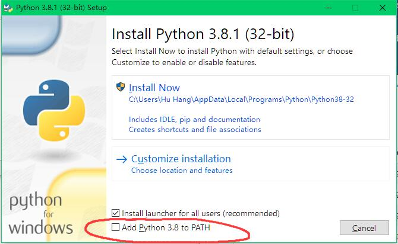
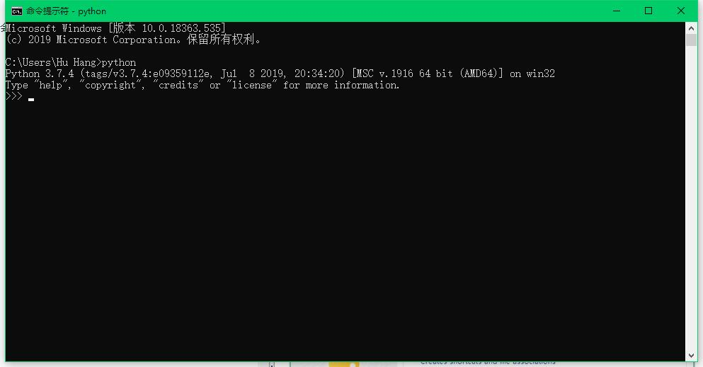
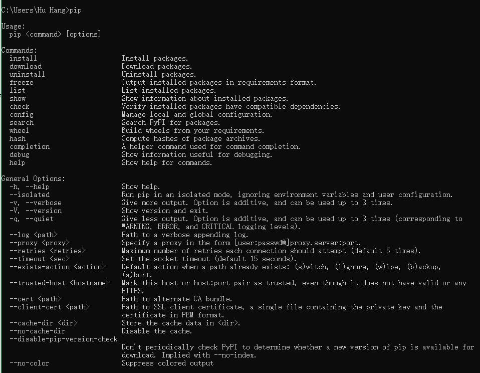
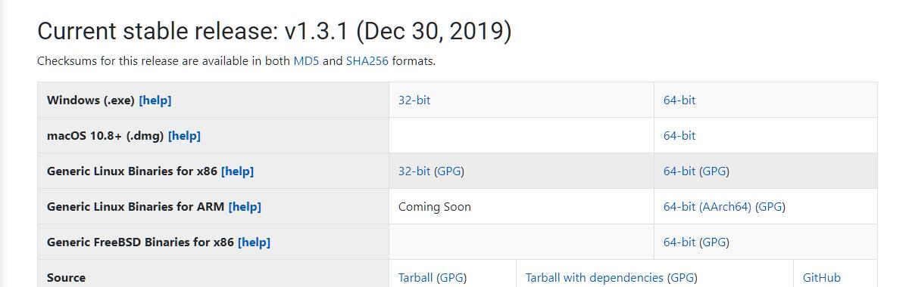
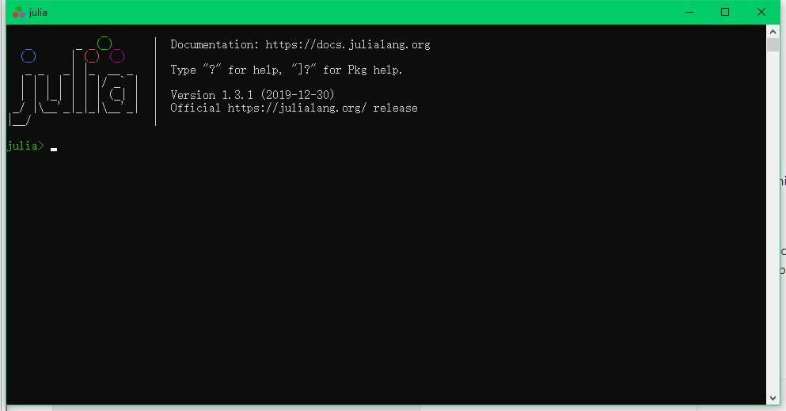
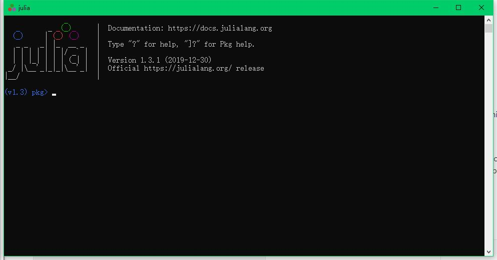
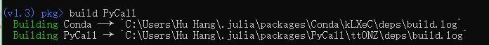

# 从零开始配环境 #
## Python ##
	
[官方下载地址](https://www.python.org/downloads/ "官方下载地址")

下载对应版本后进入安装勾选红圈的check 
添加环境变量 
**install now**  
这也会同时安装pip

然后打开命令行，检查一下python和pip是否正确安装

输入`python`显示如下则正确安装 

输入`quit()` 

在输入`pip` 
显示如下则pip正确安装

直接开始安装python所需的包

执行`pip install xxx（这里是package name）`

-所需的包
-
	numpy
	pyautogui
	PIL

## Julia ##
[官方下载地址](https://julialang.org/downloads/ "官方下载地址")

下载完成安装打开shell 

输入`]`进入包管理模式 

安装命令 `add xxx` 

-所需的包
-
	Dates
	Statistics
	PyCall
	Images
	ImageFeatures
	ImageMagick

----------

需要配置一下PyCall的环境变量 
输入`ctrl+c`
退出包管理模式

输入ENV["PYTHON"]="python" 

再次 `]`进入包管理

输入`build PyCall` 
重新构建PyCall

	

